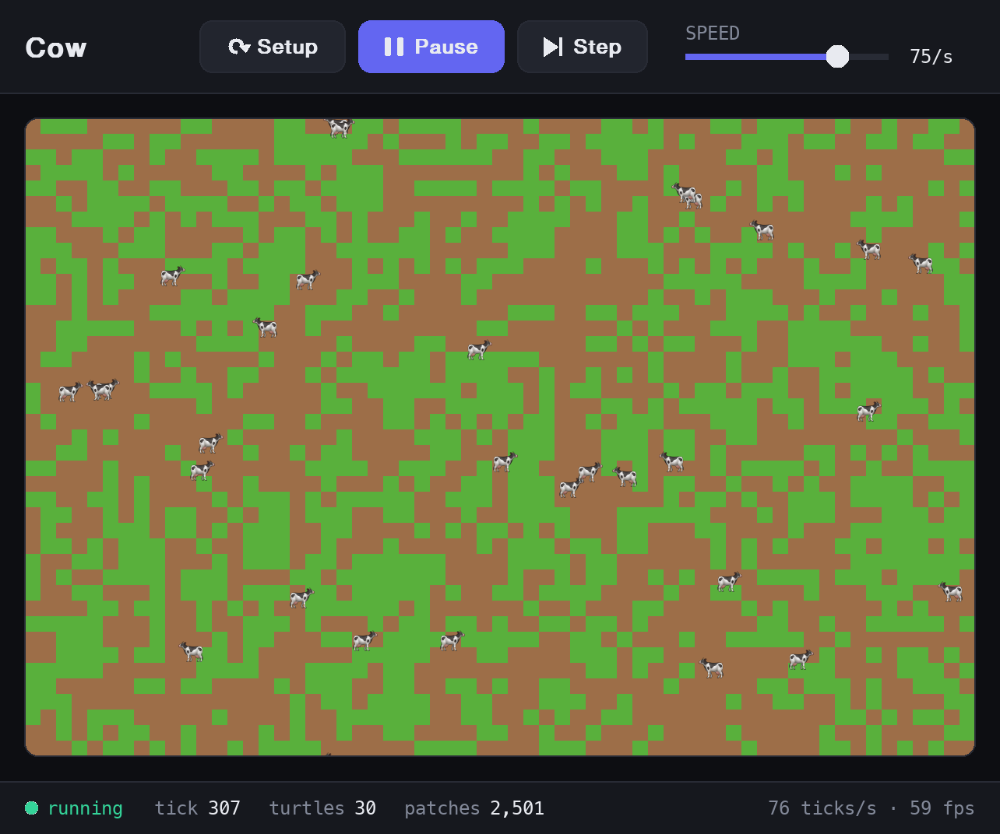
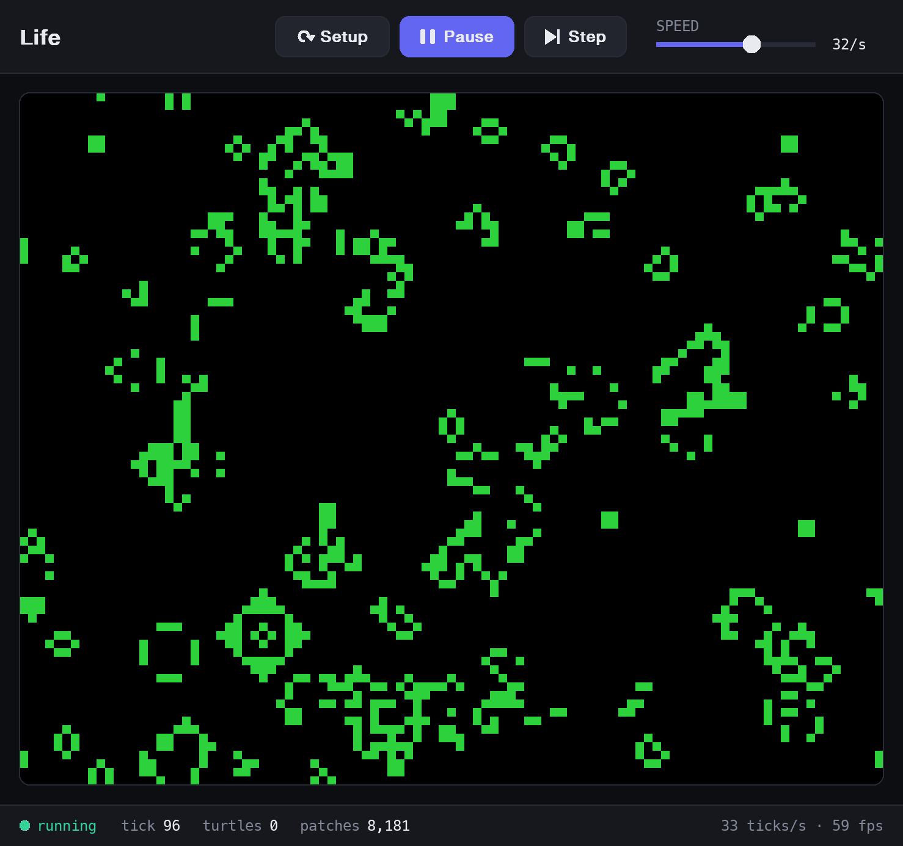
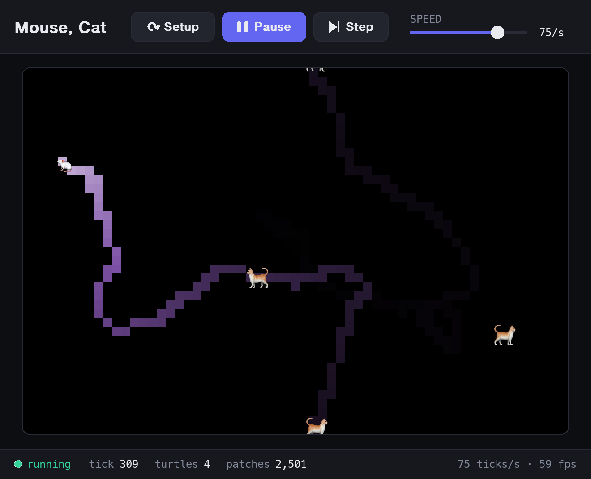
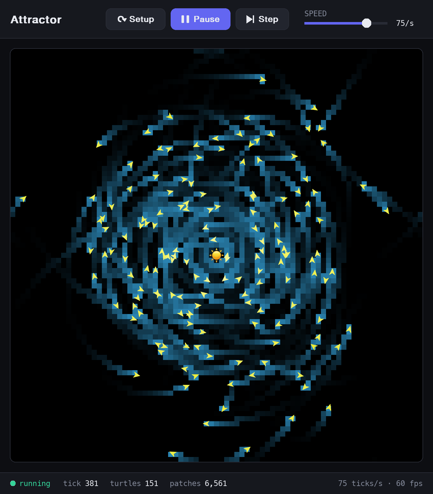

# emerge

A small NetLogo-like agent-based modeling library, written (and used) in plain Python.



```python
import random
from emerge import Model, Turtle, run

class Wanderer(Turtle):
    def setup(self):
        self.color = "blue"

    def step(self):
        self.right(random.uniform(-30, 30))
        self.forward(0.5)

run(Model(breeds={Wanderer: 100}))
```

```sh
uv run examples/wander.py
```

`run` opens a window with **Setup**, **Go** (toggle), and **Step** buttons, a speed
slider, and a tick counter. Keyboard shortcuts: `s` = Setup, `g`/space = Go, `t` = Step.

## Turtles

Subclass `Turtle` and override:

- `setup()`: called once when the turtle is created (at the origin, with a random heading and color).
- `step()`: called once per tick.

Don't override `__init__`. Each turtle can reach the world through `self.model`
(e.g. `self.model.ticks`, or `self.model.stop()` to halt the run).

### Commands

- `forward(d)` / `fd`, `back(d)` / `bk`
- `right(deg)` / `rt`, `left(deg)` / `lt`
- `move_to(turtle_or_patch)`
- `patch` (the patch underfoot), `patch_ahead(d)`
- `face(target)`: turn toward a turtle or patch
- `towards(target)`, `distance(target)`: heading to and distance from a turtle or patch
- `x`, `y`, `heading`, `color`, `size` attributes

Coordinates follow NetLogo: the origin is at the center, y points up, heading 0 is north,
and headings increase clockwise. The world wraps at its edges, and `face`, `towards`, and
`distance` take the shorter way around.

Colors are NetLogo's base color names (`"red"`, `"sky"`, `"lime"`, ... see `emerge.colors`)
or `(r, g, b)` tuples.

`scale_color(color, value, low, high)` works like NetLogo's `scale-color`: it returns a
shade of `color` running from black at `low`, through the color itself, to white at
`high`. Swap `low` and `high` to reverse it. See `examples/cat_and_mouse.py`.

### Emoji shapes

Turtles are drawn as arrows in their `color` by default. Set `shape` to an emoji to draw
that instead, and `shape_orient` to choose how it follows the turtle's heading:

```python
class Cow(Turtle):
    shape = "🐄"
    shape_orient = "flip_x"   # the default
    shape_facing = 270        # the direction the emoji is drawn facing (west)
```

| `shape_orient` | The emoji... |
| --- | --- |
| `None` | never changes |
| `"rotate"` | rotates so its facing direction matches the heading |
| `"flip_x"` | mirrors left/right to face east or west |
| `"flip_y"` | mirrors top/bottom to face north or south |
| `"flip_xy"` | does both, e.g. 🚀 with `shape_facing = 45` |

Most animal emoji face west, hence the default `shape_facing = 270`. These can be class
attributes or set per turtle. Emoji use the system's color emoji font; if there isn't one
(or it lacks the glyph), the turtle falls back to an arrow with a warning.

## Patches

The world is a grid of patches with integer coordinates. To give them state and behavior,
subclass `Patch` and override:

- `setup()`: called once on Setup, before any turtles are created.
- `step()`: called once per tick, after all the turtles have stepped.

Patches have `x`, `y`, and `color` (default black), plus `neighbors` (8), `neighbors4`,
`turtles` (the turtles standing on it), and `patch_at(dx, dy)`.

```python
class Grass(Patch):
    def setup(self):
        self.grown = True
        self.color = "green"

class Cow(Turtle):
    def step(self):
        self.forward(0.5)
        if self.patch.grown:
            self.patch.grown = False
            self.patch.color = "brown"
```

See `examples/grazing.py` for the full model.

## Model

`Model(breeds={Wolf: 10, Sheep: 100}, patch_class=Grass)` fills the world with
`Grass` patches and creates that many of each turtle class on Setup. Each tick it steps
every turtle, then every patch, each in random order.

The model has `turtles`, `patches`, `ticks`, and `patch_at(x, y)` (the patch containing
any point).

World settings are constructor arguments: `max_x`, `max_y` (the world spans
`-max_x..max_x` patches) and `patch_size` (pixels). For world-level behavior, subclass
`Model` and override `setup()` or `go()`, setting the same names as class attributes.

## Examples

Run any of these with `uv run examples/<name>.py`.

| Example | What it shows |
| --- | --- |
| [`wander.py`](examples/wander.py) | Turtles moving, turning, and changing color |
| [`circles.py`](examples/circles.py) | Turtle `setup()`, and a model stopping itself |
| [`grazing.py`](examples/grazing.py) | Patches with state, turtles changing the patch underfoot, and emoji shapes |
| [`life.py`](examples/life.py) | Patches only: Conway's Game of Life with a custom `go()` |
| [`cat_and_mouse.py`](examples/cat_and_mouse.py) | `face`, `distance`, and `scale_color` |
| [`attractor.py`](examples/attractor.py) | Turtles with their own state (velocity) orbiting an emoji sun and spiraling in |

| Game of Life | Cat and mouse | Attractor |
| --- | --- | --- |
|  |  |  |

## Development

```sh
uv run pytest
```

## License

MIT. See [LICENSE](LICENSE).
